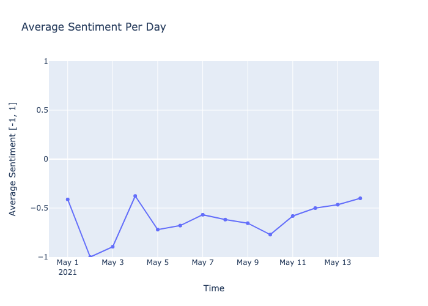
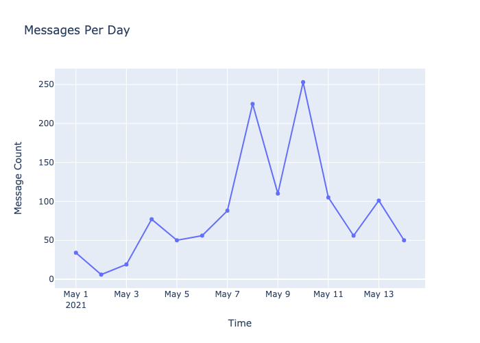

# Sentiment Analysis of Crypto Chat

This project was run under Python 3.9.6.

## 1. Setup and Execution
```sh
python3 -m venv env
source env/bin/activate
pip install -r requirements.txt

# Run the main.py python file to generate the plots
# Plots are created in the images directory
python main.py
```

## 2. Summary
For Sentiment Analysis I used the `transformers` library. I used the DistilBERT Base Uncased English model, which is finetuned on the Stanford Sentiment Treebank (SST). 

For preprocessing, the input text is all lowercased and is filtered on two criteria:
 1. Whether the text contains english characters,
 1. Whether the text contains keywords: "SHIB" or "DOGE".

The results show that on average the sentiment of messages that contained the keyword "SHIB" or "DOGE" was negative, every day ranging from May 1st 2021 to May 15th 2021.

## 3. Plots
The final plots are as shown below:



